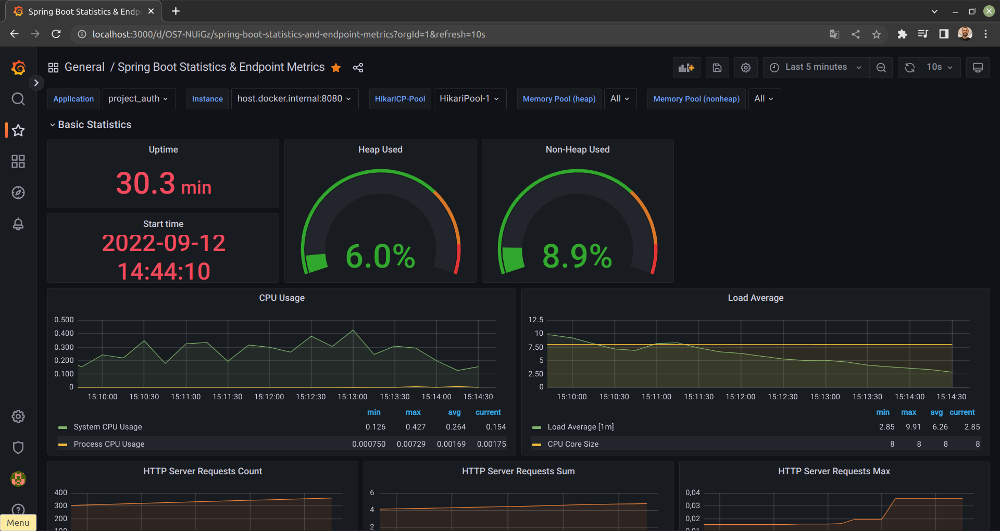
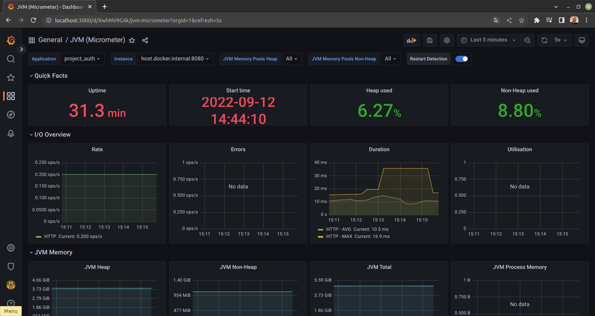

SpringBoot Base Project for new applications. Builded with: 

- Spring Security Oauth2
- PostgreSQL
- Docker Compose
- Flyway
- Spring Doc Open API 3
- Model Mapper
- Actuator
- Prometheus
- Grafana  
- Lombok

How to run:

- Download project and open with you IDE
- Execute: 
            
        docker-compose up

- Create new database on Docker local PostgreSQL running with name:

        project_auth

- Start Application. Done!

- Tips in first run:

    - First time start application with flyway FALSE!
      
          spring.flyway.enabled=false
    - Second time start application with flyway TRUE!
      
          spring.flyway.enabled=true

Why!? Because Schema Creation is active with Hibernate, then the tables are created by him.

And now? 
Then YOU choose...

- Close Application:

        docker-compose down

How to use:

- Default Users in Database:
  
      user: admin@gmail.com
      password: 123
  
      user: user@gmail.com
      password: 123

- PostgreSQL Default access:

      URL: localhost:5432/auth_project
      username: postgres
      password: 123

- Collections: 
  
    import postman collections in:
                
        src/main/resources/collections

- Spring Doc Open API 3:
  
        http://localhost:8080/swagger-ui/index.html
- Grafana: 
  
        http://localhost:3000
  
    Default Grafana access:

        user: admin
        password: admin

- SpringBoot Statistics Dashboard:  
    

- Micrometer JVM Statistics Dashboard:
  
    

- Prometheus:

        http://localhost:9090/graph

- Actuator:
  
        http://localhost:8080/actuator
- Actuator | Prometheus:
  
        http://localhost:8080/actuator/prometheus

